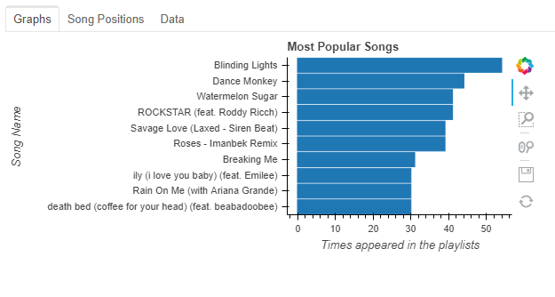

# Spotify Analysis

## Authors
- Eduardo Manuel Ceja Cruz lalitoceja@gmaill.com
- Nikolai García Chkourak nikolai.garcia.98@gmail.com

## License:
GNU General Public License version 3


# Introduction

This project will atempt to give an analysis of songs from Spotify using a  library that implements the [Spotify API](https://developer.spotify.com/documentation/web-api/) into python called [Spotipy](https://github.com/plamere/spotipy). The objective of this analysis is to know which are the most listened songs in spotify by using the "TOP 50" playlist of every country that spotify generates.


# Instructions
1. First, you need to install the following libraries:
    * [Spoitpy library](https://github.com/plamere/spotipy)

        An implementation of the spotify API into python.

        You can do this by simply running `pip install spotipy`

    * [Bokeh](https://docs.bokeh.org/en/latest/docs/installation.html)
        
        A library made for data visualization with more tools and flexibility than matplotlib. We use it for generating the gaphs, it's interactivity and exporting them to html.

        Again, you can do it with `pip install bokeh`

    * [Pandas](https://pandas.pydata.org/pandas-docs/stable/getting_started/install.html)

        A library made for data processing, analysis and manipulation. We used it to process the data gathered from spotify to get the stats and the data for the graphs.

        Like the ones above, it can be installed with `pip install pandas`

    * [MySQL Connector](https://dev.mysql.com/doc/connector-python/en/connector-python-installation.html)

        As the name suggest, this library is a way to connect a MySQL database with python. We used it to automate the storing of data to the SQL database.

    For all this libraries, we recommend to follow the instructions provided and to check the libraries you have installed. To do this, type  `pip list` or `python -m pip list` in the terminal.

2. Then, you need to get the credentials for your spotify account

    1. Go to the dashboard in the [spotify developer page](https://developer.spotify.com/dashboard/)

    2. Log in with your spotify account.

    3. Create a new app by clicking "My New App". If you don't know yet for what purpose you want for your app, tick the "I don't know" option. Give it a title and a description and tick all the boxes in the next page.
    

    4. On the left side you can find your "Client ID" and your "Client Secret". Sometimes the "spotipy" script requiers a redirect page. For that, go to "Edit Settings" and set "https://www.google.com/" (or any other generic and stable page) as your Redirect URI.
    


3. Set up MySQL Database
    ### Installation:
    #### Linux:
    
    To install MySQL, open a terminal and type the following `sudo apt-get install mysql-server mysql-client` for ubuntu and devian.

    #### Windows:

    Download the instaler from the page of [mysql](https://dev.mysql.com/downloads/installer/) and execute it. For more information, you can visit the [MySQL Windows installation guide](https://dev.mysql.com/doc/refman/8.0/en/windows-installation.html)

    ### Setup:

    After the installation, you'll need to create a user. In the termial type `sudo su` for linux or comand line in administrator mode in windows, then, without leaving the mysql pompt type

    ```bash
    mysql_secure_instalation
    ```

    This will begin the instalation and will ask for a password for root, after this, without leaving super user, enter to 
    
    ```sql
    CREATE USER 'user'@'localhost' IDENTIFIED BY 'password';
    ```
    **Replace `user` and `password` with the actual values you are going to use**

    Then, create the database with `CREATE DATABASE db_name;` replacing `db_name` with the name of the database

    Now, to create the tables, you can copy the contents from `spotify_tracks_table.sql` or, outside of the mysql promt, in the terminal type: `mysql -u user -p db_name < spotify_tracks_table.sql`

    NOTE: Be sure to cahnge `db_name` for the name of your database in the sql file. If you're copying from the file, be sure to type 
    ```sql
    ALTER DATABASE db_name CHARACTER SET utf8mb4 COLLATE utf8mb4_unicode_ci; 
    ```
    This is because, some of the values are not in ascii (like chinese, japanese, korean and thai characters) and will cause an issue with the data base

    To finish the setup, you'll need to input your credentials in the dictioanry that is called config in the  `db_connection.py`, you can leave it there (not recomended) or you can use the method `write_config`. Other alternative, is to create a json file named config.json with the following data:
    ```json
    {"user": "user", "password": "password", "host": "127.0.0.1", "database": "db_name", "raise_on_warnings": True}
    ```
    Replace `user`, `password` and `db_name` with the ones intended
    
4. You can run the scripts now. This scrips need to be run in a particular order, first, run `collect_data_from_spotify.py` then `processing_and_graphs.py <int>` where `<int>` is an optional parameter that represents how many songs will be displayed in the graphs, it defaults to 10.  If done correctly, it should generate a file named `Graficas.html` that will contain the graphs.

# Graphs

These screenshots represent a part of the graphs that are generated. Due to the size of the second graph, we will only show one example.

## This graph represents the songs and the amount of times it has appeared in the playlist 


## The second graph, represents the song positions in the countries playlist


## This is the data qe used represeted in tables.


# Resources:
## Data stream:
- Spotify
## Data processing:
- Python 3 
- Pandas

## Visualization:
- Bokeh

## Data storage:
- json files
- MySQL
